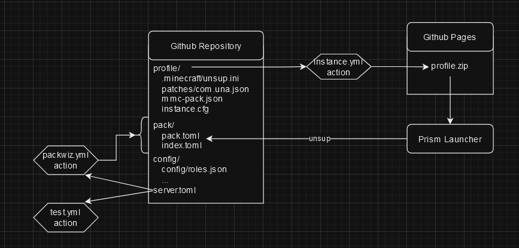

# ModFest 1.20: Sky and Sea

## Structure

| [Packwiz Pack URL](https://raw.githack.com/ModFest/modfest-skyandsea/main/pack/pack.toml) | [Prism Launcher Instance zip](https://modfest.github.io/modfest-skyandsea/content/profile.zip) |
| --- | --- |

- `profile` - Prism launcher profile
- `config` - Server config files
- `pack` - Packwiz pack generated by mcman
- `server` - mcman build output (local)

## Contributing

Here are some things to note:

- Currently, this repo is using [mcman](https://github.com/ParadigmMC/mcman) and its documentation can be found [here](https://paradigmmc.github.io/mcman/)
- mcman generates the packwiz pack found under `pack/` automatically using `packwiz.yml` action
- the prism profile is generated using the `profile/` folder automatically using `instance.yml`
- server's list of mods and options can be found in `server.toml`
- configuration files are found under `config/`
- run `mcman build` to get all the server files under `server/`
- run `mcman run --test` to test if the server can start without crashing
- run `mcman md` to update the markdown found below

---

## Server

<!--start:mcman-server-->
| Version | Type                            | Loader   |
| ------- | ------------------------------- | -------- |
| 1.20.4  | [Fabric](https://fabricmc.net/) | `0.15.3` |
<!--end:mcman-server-->

## List of Mods

<!--start:mcman-addons-->
| Name                                                                                             | Description                                                                                                                                                              | Version                                                        |
| ------------------------------------------------------------------------------------------------ | ------------------------------------------------------------------------------------------------------------------------------------------------------------------------ | -------------------------------------------------------------- |
| [Cerulean](https://modrinth.com/mod/cerulean)                                                    | Stars, automation, trinkets, and a dream...                                                                                                                              | it1V9161                                                       |
| [Partnership](https://modrinth.com/mod/partnership)                                              | Drive ships with partners. Defend your port with cannons and explore the world with new ships!                                                                           | yMU48SrD                                                       |
| [Seagulls](https://modrinth.com/mod/seagulls)                                                    | A stupid Minecraft mod adding annoying seagulls                                                                                                                          | yP2sUiVD                                                       |
| [Pescatore](https://modrinth.com/mod/pescatore)                                                  | Another fishing minigame in Minecraft!                                                                                                                                   | X6Nwdhrz                                                       |
| [Contrail](https://modrinth.com/mod/contrail)                                                    | This mod adds contrails to Minecraft.                                                                                                                                    | UNlU07tE                                                       |
| [PET Bottle Rocket](https://modrinth.com/mod/pet-bottle-rocket)                                  | Make a Water Bottle Rocket! Inspired by STEM Learning.                                                                                                                   | R0eL60ot                                                       |
| [Rapscallions and Rockhoppers (Penguins)](https://modrinth.com/mod/rapscallions-and-rockhoppers) | A fresh, new take on the 2023 Mob Vote's Penguin.                                                                                                                        | qEfshhwq                                                       |
| [Boatism](https://modrinth.com/mod/boatism)                                                      | Add new and fully customizable Boat Engines to Minecraft. Traveling by sea will never be the same again!                                                                 | Ht1D8Dus                                                       |
| [Glide](https://modrinth.com/mod/glide)                                                          | Paragliding                                                                                                                                                              | SSgjgT31                                                       |
| [Pescatore](https://modrinth.com/mod/pescatore)                                                  | Another fishing minigame in Minecraft!                                                                                                                                   | X6Nwdhrz                                                       |
| [Clouded Isles](https://modrinth.com/mod/clouded-isles)                                          | inspired by terraria's sky islands, this mod adds new equipment and blocks obtained from the "sky isle" structure. made for modfest 1.20                                 | a5PWns3Z                                                       |
| [Glide Away!](https://modrinth.com/mod/glide-away)                                               | Get your Hang Glider and glide away from the dangers! A server side Fabric mod!                                                                                          | jXRfaWdl                                                       |
| [Anshar](https://modrinth.com/mod/anshar)                                                        | Write yourself into the Akashic Record with the power of beacons!                                                                                                        | t6F0gIBS                                                       |
| [Reel Fishing](https://modrinth.com/mod/reel)                                                    | Reel Fishing adds a fishing minigame, modular fishing rods, new fish, terrible puns and more.                                                                            | QigKV8wN                                                       |
| [FLUIwID](https://modrinth.com/mod/fluiwid)                                                      | Don't like being solid? Be water instead!                                                                                                                                | BwvIvKNi                                                       |
| [Schmarrn Fireworks](https://modrinth.com/mod/schmarrn-fireworks)                                | Add Items to special Firework Rockets!                                                                                                                                   | ayB8Dm59                                                       |
| [Pesky Seagulls](https://modrinth.com/mod/pesky-seagulls)                                        | Adds bothersome seagulls                                                                                                                                                 | KLntrhIl                                                       |
| [Clouded Isles](https://modrinth.com/mod/clouded-isles)                                          | inspired by terraria's sky islands, this mod adds new equipment and blocks obtained from the "sky isle" structure. made for modfest 1.20                                 | a5PWns3Z                                                       |
| [Pesky Seagulls](https://modrinth.com/mod/pesky-seagulls)                                        | Adds bothersome seagulls                                                                                                                                                 | KLntrhIl                                                       |
| [Moonrise](https://modrinth.com/mod/moonrise)                                                    | A mod that allows the moon to move across the sky, separate from the sun! (Made for ModFest 23!)                                                                         | FbllYDtE                                                       |
| [PotatoesPlus](https://modrinth.com/mod/potatoesplus)                                            | Add some special potatoes to your game!                                                                                                                                  | VfB11R7N                                                       |
| [Wizcraft](https://modrinth.com/mod/wizcraft)                                                    | Functional magic tools                                                                                                                                                   | S5yx6Hq5                                                       |
| [resurfaced](https://modrinth.com/mod/resurfaced)                                                | Making underwater exploration easier in a simple way                                                                                                                     | XstshMSP                                                       |
| [Blocky Bass](https://modrinth.com/mod/blocky-bass)                                              | Adds Big Mouth Blocky Bass to the game.  Fish him up, feed him a disc, watch him sing!                                                                                   | V8mKhZR1                                                       |
| [Mutagen](https://modrinth.com/mod/mutagen)                                                      | Brew a new kind of splash potion that turns peaceful mobs into useful mutated versions!                                                                                  | hgcY7Gea                                                       |
| [Pescatore](https://modrinth.com/mod/pescatore)                                                  | Another fishing minigame in Minecraft!                                                                                                                                   | X6Nwdhrz                                                       |
| [Reel Fishing](https://modrinth.com/mod/reel)                                                    | Reel Fishing adds a fishing minigame, modular fishing rods, new fish, terrible puns and more.                                                                            | QigKV8wN                                                       |
| [Flutter & Flounder](https://modrinth.com/mod/flutterandflounder)                                | Fight for your life against waves of powerful fish, all in an attempt to meet your quota for some sweet, sweet rewards.                                                  | S33yyx2G                                                       |
| [Capiche](https://modrinth.com/mod/capiche)                                                      | Add some (one) interesting caps                                                                                                                                          | ItXNThQy                                                       |
| [Skybox at Home](https://modrinth.com/mod/skybox_athome)                                         | Yet another skybox mod, but it displays your customiezd 360° panoramic images with equirectangular projection. No, we have skybox at home!                               | A9YpZkm1                                                       |
| [Gods Of Olympus](https://modrinth.com/mod/gods-of-olympus)                                      | Gods of the sky and sea                                                                                                                                                  | Xn2UTgH0                                                       |
| [Boids](https://modrinth.com/mod/boids)                                                          | Boids simulation for flocking fish                                                                                                                                       | OeCnoEPH                                                       |
| [Birds \| Boids Addon](https://modrinth.com/mod/birds-boids-addon)                                | Adds birds                                                                                                                                                               | vXooxCiH                                                       |
| [Arctic](https://modrinth.com/mod/arctic)                                                        | A mini overhaul of cold biomes.                                                                                                                                          | WWFqiy4s                                                       |
| [Toxic Sky & Plastic Seas](https://modrinth.com/mod/toxsky)                                      | Garbage patches in the ocean near you.                                                                                                                                   | yGe0HVjV                                                       |
| [Gadgets of the Sky](https://modrinth.com/mod/gadgets-of-the-sky)                                | Adds various gadgets, useful for travel, combat and more.                                                                                                                | KrtWsfxN                                                       |
| [Whalestrom](https://modrinth.com/mod/whalestrom)                                                | Adds flying whales to the game!                                                                                                                                          | 29fBggbX                                                       |
| [Cerulean](https://modrinth.com/mod/cerulean)                                                    | Stars, automation, trinkets, and a dream...                                                                                                                              | it1V9161                                                       |
| [env.json](https://modrinth.com/mod/env.json)                                                    | A small FabricMC library allowing to convert an `env.json` file into a Java Object. It is mostly used by Environment Driven Assets and Environment Driven Data.          | t6ECu50t                                                       |
| [Environment Driven Assets](https://modrinth.com/mod/env-driven-assets)                          | Environment Driven Assets is a FabricMC mod which implements the env.json library in order to apply it on vanilla asset types.                                           | GpoGWc3F                                                       |
| [Operation: Starcleave](https://modrinth.com/mod/operation-starcleave)                           | Cleave open the sky, and unite Earth with the Heavens.                                                                                                                   | mEjD68Hw                                                       |
| [Arctic](https://modrinth.com/mod/arctic)                                                        | A mini overhaul of cold biomes.                                                                                                                                          | WWFqiy4s                                                       |
| [Clouded Isles](https://modrinth.com/mod/clouded-isles)                                          | inspired by terraria's sky islands, this mod adds new equipment and blocks obtained from the "sky isle" structure. made for modfest 1.20                                 | a5PWns3Z                                                       |
| [Blocky Bass](https://modrinth.com/mod/blocky-bass)                                              | Adds Big Mouth Blocky Bass to the game.  Fish him up, feed him a disc, watch him sing!                                                                                   | V8mKhZR1                                                       |
| [Perihelion](https://modrinth.com/mod/perihelion)                                                | A dimension mod focused around traveling to the sun                                                                                                                      | fFBFJaJ5                                                       |
| [Starcaller](https://modrinth.com/mod/starcaller)                                                | Pull stars from the sky and reshape them just like the old tales. Navigate using named stars. Start a color turf-war. Paint art.                                         | MjDyRyZv                                                       |
| [Loggerhead Luminancies](https://modrinth.com/mod/loggerhead-luminancies)                        | Adds a sea lantern variant crafted using scutes that can float in water.                                                                                                 | cWb8HuiP                                                       |
| [WeatherSync](https://modrinth.com/mod/weathersync)                                              | Server-side mod to sync peoples' weather to the real world!                                                                                                              | vqS5f5pQ                                                       |
| [Anshar](https://modrinth.com/mod/anshar)                                                        | Write yourself into the Akashic Record with the power of beacons!                                                                                                        | t6F0gIBS                                                       |
| [Environment Driven Assets](https://modrinth.com/mod/env-driven-assets)                          | Environment Driven Assets is a FabricMC mod which implements the env.json library in order to apply it on vanilla asset types.                                           | GpoGWc3F                                                       |
| [Fishhead](https://modrinth.com/mod/fishhead)                                                    | Have you ever wanted to be a horse? Well we don't know much about horses actually, but we can help you become one with the fish! This mod lets you wear pufferfish.      | J13DyBPM                                                       |
| [The Sky's The Limit](https://modrinth.com/mod/the-skys-the-limit)                               | The sky wasn't limiting enough, so I put a ceiling on it!                                                                                                                | 4eOE93dU                                                       |
<!--end:mcman-addons-->
